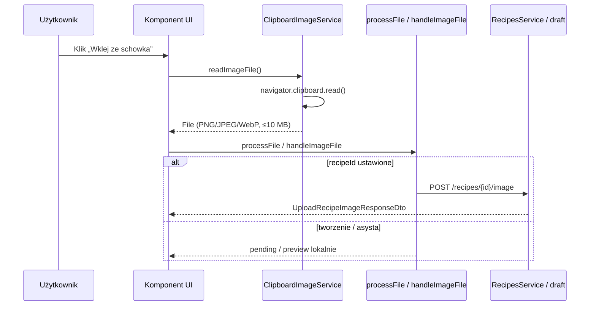

# Plan implementacji widoku — przycisk „Wklej ze schowka” (PS-92)

## 1. Przegląd

PS-92 rozszerza istniejące widoki formularza przepisu i asysty AI o dedykowany przycisk **„Wklej ze schowka”**, który odczytuje obraz przez **Clipboard API** (`navigator.clipboard.read()`) bez konieczności ustawiania fokusu na strefie paste (Ctrl+V).

Zmiana **nie wprowadza nowego widoku routowanego**. Dotyczy:

- formularza tworzenia i edycji przepisu (`RecipeFormPageComponent` → `RecipeImageUploadComponent`),
- ekranu asysty AI w trybie obrazu (`RecipeNewAssistPageComponent`).

Istniejące metody wgrywania (plik, drag & drop, Ctrl+V) pozostają bez zmiany zachowania. Po poprawnym wklejeniu obraz przechodzi tą samą ścieżką co przy paste/drop: podgląd, tryb tworzenia — plik pending do zapisu, tryb edycji — natychmiastowy upload przez `POST /recipes/{id}/image` z opcją Undo.

**Endpointy API:** bez zmian (upload zdjęcia jak dotychczas).

## 2. Routing widoku

Brak nowych tras i guardów.


| Trasa                 | Komponent                      | Rola PS-92                                                                  |
| --------------------- | ------------------------------ | --------------------------------------------------------------------------- |
| `/recipes/new`        | `RecipeFormPageComponent`      | Przycisk w `RecipeImageUploadComponent` (tryb tworzenia, `recipeId = null`) |
| `/recipes/:id/edit`   | `RecipeFormPageComponent`      | Ten sam komponent uploadu (auto-upload po wklejeniu)                        |
| `/recipes/new/assist` | `RecipeNewAssistPageComponent` | Przycisk w strefie `.image-paste-area` / przy podglądzie obrazu             |


Trasy pozostają pod lazy-loaded `recipesRoutes`, chronione `usernameCompleteMatchGuard` na poziomie `/recipes`. Asysta może mieć dodatkowy guard roli (`premium`) — PS-92 nie modyfikuje polityki dostępu.

## 3. Struktura komponentów

```text
src/app/shared/services/
└── ClipboardImageService                              [NOWY]
    └── clipboard-image.messages.ts (opcjonalnie)      [NOWY — stałe komunikatów]

/recipes/new | /recipes/:id/edit
└── RecipeFormPageComponent                            [bez zmian routingu]
    └── RecipeImageUploadComponent                     [MODYFIKACJA — UI + handler]
        ├── processFile(file)                          [istniejący — wspólna ścieżka sukcesu]
        ├── onPaste(ClipboardEvent)                    [MODYFIKACJA — spójne komunikaty]
        └── RecipesService.uploadRecipeImage           [istniejący — tylko edycja]

/recipes/new/assist
└── RecipeNewAssistPageComponent                       [MODYFIKACJA — przycisk + handler]
    ├── handleImageFile(file)                          [istniejący — po sukcesie serwisu]
    ├── onPaste @HostListener                          [MODYFIKACJA — komunikaty]
    └── AiRecipeDraftService → POST /ai/recipes/draft  [bez zmian]
```

Diagram przepływu (happy path — przycisk):




## 4. Szczegóły komponentów


### `ClipboardImageService`

- **Plik:** `src/app/shared/services/clipboard-image.service.ts`
- **Opis:** Współdzielona logika detekcji Clipboard API, odczytu obrazu ze schowka, walidacji MIME i rozmiaru oraz mapowania błędów na komunikaty z kryteriów akceptacji PS-92.
- **Główne elementy:** metody publiczne `isClipboardReadSupported()`, `readImageFile()`, `messageForError(error: unknown): string`; prywatne stałe dozwolonych MIME i limitu 10 MB (zgodnie z `RecipeImageUploadComponent` i API).
- **Obsługiwane zdarzenia:** brak — serwis bez UI; wywoływany z komponentów po kliknięciu przycisku.
- **Walidacja (przed zwróceniem** `File`**):**
  - brak elementu obrazu w schowku → błąd z kodem `NO_IMAGE`;
  - MIME poza `image/png`, `image/jpeg`, `image/webp` → `UNSUPPORTED_FORMAT`;
  - rozmiar blob > 10 × 1024 × 1024 → `FILE_TOO_LARGE`;
  - `NotAllowedError` / odmowa uprawnień → `PERMISSION_DENIED`;
  - brak API / nie-secure context → wykrywane przez `isClipboardReadSupported()`, nie przez `readImageFile()`.
- **Typy:** `ClipboardImageErrorCode`, klasa `ClipboardImageError` (lub równoważny wzorzec z polem `code`).
- **Propsy:** brak (`providedIn: 'root'`, `inject()` w konsumentach).

**Detekcja API (z planu UI):**

```typescript
isClipboardReadSupported(): boolean {
    return typeof navigator !== 'undefined'
        && window.isSecureContext
        && !!navigator.clipboard?.read;
}
```

Gdy `false`: przycisk **disabled** (nie ukrywać na desktopowych przeglądarkach z API), tooltip z informacją o alternatywach (Ctrl+V, drag & drop, wybór pliku).

### `RecipeImageUploadComponent`

- **Pliki:** `src/app/pages/recipes/recipe-form/components/recipe-image-upload/`*
- **Opis:** Strefa zdjęcia formularza przepisu (US-027). PS-92 dodaje przycisk Material i integrację z `ClipboardImageService`.
- **Główne elementy HTML:**
  - **Stan pusty (drop zone):** pod hintem „JPG, PNG lub WebP (max. 10 MB)” — `mat-stroked-button` z ikoną `content_paste`, etykieta „Wklej ze schowka”, `aria-label="Wklej zdjęcie ze schowka"`.
  - **Stan z podglądem:** obok „Zmień zdjęcie” — drugi `mat-stroked-button` „Wklej ze schowka”.
  - Istniejący blok `.upload-error` pod strefą na komunikaty błędów (nie snackbar, poza Undo po uploadzie).
- **Obsługiwane interakcje:**
  - `(click)` na przycisku schowka → `$event.stopPropagation()` (nie otwiera file pickera drop zone);
  - `onPasteFromClipboardClick()` — async odczyt serwisu → `processFile(file)`;
  - Ctrl+V, drag & drop, klik drop zone, usuń zdjęcie, Undo — bez zmiany logiki biznesowej.
- **Warunki disabled przycisku schowka:** `disabled || isUploading || !clipboardSupported`.
- **Walidacja:** po odczycie serwis waliduje MIME i rozmiar; `processFile()` nadal waliduje jako druga linia obrony (spójne komunikaty po ujednoliceniu tekstów).
- **Typy:** istniejące `RecipeImageUploadUiState`, `RecipeImageEvent`, `RecipeImageUndoSnapshot`; odpowiedź uploadu: `UploadRecipeImageResponseDto`.
- **Propsy (interfejs komponentu):**
  - `@Input() recipeId: number | null`
  - `currentImageUrl = input<string | null>(null)`
  - `@Input() disabled = false`
  - `@Output() imageEvent: EventEmitter<RecipeImageEvent>`

**Stan w komponencie (nowy):** sygnał lub pole ustawione w `ngOnInit`: `clipboardSupported = clipboardImageService.isClipboardReadSupported()`.

**Ujednolicenie komunikatów:** zaktualizować `onPaste()` i `processFile()` do tekstów z user story (tabela w sekcji 10), np.:

- brak obrazu: „Schowek nie zawiera obrazu. Skopiuj grafikę i spróbuj ponownie.”
- format: „Nieobsługiwany format pliku. Dozwolone formaty: PNG, JPG, WebP.”
- rozmiar: „Plik jest zbyt duży. Maksymalny rozmiar to 10 MB.”


### `RecipeFormPageComponent`

- **Plik:** `src/app/pages/recipes/recipe-form/recipe-form-page.component.ts` / `.html`
- **Opis:** Kontener formularza; **bez zmian szablonu** poza ewentualnymi stylami kontenera przycisków, jeśli potrzebne — logika schowka jest wewnątrz `RecipeImageUploadComponent`.
- **Obsługiwane zdarzenia:** `onImageEvent` — bez zmian (`pendingFileChanged`, `uploaded`, `deleted`, `uploadingChanged`).
- **Walidacja:** brak nowych warunków; `disabled` na uploadzie gdy `saving()` lub `aiGenerating()`.
- **Typy:** `RecipeFormViewModel`, `CreateRecipeCommand`, `UpdateRecipeCommand` — bez nowych pól.
- **Propsy:** brak (komponent routowany).


### `RecipeNewAssistPageComponent`

- **Pliki:** `src/app/pages/recipes/recipe-new-assist/`*
- **Opis:** Asysta AI; w trybie `source() === 'image'` dodaje ten sam przycisk „Wklej ze schowka”.
- **Główne elementy:**
  - W `.image-paste-area`, pod `.paste-formats` — `mat-stroked-button` (reguły jak w uploadcie formularza).
  - Gdy `imagePreviewUrl()` jest ustawiony — przycisk obok akcji usuwania (np. pod podglądem lub w rzędzie akcji), umożliwiający **zastąpienie** obrazu ze schowka (scenariusz AC 7).
- **Obsługiwane interakcje:**
  - `onPasteFromClipboardClick()` → `readImageFile()` → `handleImageFile(file)`;
  - `@HostListener('paste')` — zaktualizowane komunikaty; opcjonalnie delegacja odczytu przez serwis tylko gdy w przyszłości ujednolici się paste klawiaturowy z API (minimum: wspólne stałe komunikatów).
- **Walidacja:** `handleImageFile` + stałe `ALLOWED_IMAGE_TYPES` / `MAX_IMAGE_SIZE` — zsynchronizować brzmienie błędów ze serwisem.
- **Typy:** `AiRecipeDraftImageMimeType`, istniejące sygnały `imageFile`, `imagePreviewUrl`, `errorMessage`.
- **Propsy:** brak.

**Importy Material:** dodać `MatTooltipModule` tam, gdzie brakuje (tooltip przy disabled).

## 5. Typy


### Istniejące DTO (bez zmian kontraktu)


| Typ                                           | Zastosowanie                                                                                                |
| --------------------------------------------- | ----------------------------------------------------------------------------------------------------------- |
| `UploadRecipeImageResponseDto`                | Odpowiedź `POST /recipes/{id}/image` po wklejeniu w edycji (`id`, `image_path`, opcjonalnie `image_url`)    |
| `CreateRecipeCommand` / `UpdateRecipeCommand` | Zapis formularza; zdjęcie w tworzeniu jako pending `File` + upload po utworzeniu przepisu (istniejący flow) |


### Nowe typy (warstwa frontendu — serwis schowka)

```typescript
/** Dozwolone typy MIME — spójne z API uploadu zdjęcia */
export const CLIPBOARD_IMAGE_ACCEPTED_MIME_TYPES = [
    'image/jpeg',
    'image/png',
    'image/webp',
] as const;

export type ClipboardAcceptedMimeType = (typeof CLIPBOARD_IMAGE_ACCEPTED_MIME_TYPES)[number];

export const CLIPBOARD_IMAGE_MAX_BYTES = 10 * 1024 * 1024;

export type ClipboardImageErrorCode =
    | 'NO_IMAGE'
    | 'UNSUPPORTED_FORMAT'
    | 'FILE_TOO_LARGE'
    | 'PERMISSION_DENIED'
    | 'READ_FAILED';

export class ClipboardImageError extends Error {
    constructor(
        readonly code: ClipboardImageErrorCode,
        message: string,
    ) {
        super(message);
        this.name = 'ClipboardImageError';
    }
}
```

**ViewModel:** brak nowego modelu widoku na poziomie strony. Stan UI pozostaje w sygnałach komponentów (`error`, `previewUrl`, `imageFile`, `clipboardSupported`).

### Istniejące typy komponentu uploadu (bez zmian struktury)

- `RecipeImageUploadUiState`: `'idle' | 'dragover' | 'uploading' | 'success' | 'error'`
- `RecipeImageEvent`: union zdarzeń emitowanych do `RecipeFormPageComponent`


## 6. Zarządzanie stanem

PS-92 **nie wymaga** NgRx, nowego store ani dedykowanego hooka.


| Stan                                | Lokalizacja                                                   | Cel                                 |
| ----------------------------------- | ------------------------------------------------------------- | ----------------------------------- |
| `error` / `errorMessage`            | `RecipeImageUploadComponent` / `RecipeNewAssistPageComponent` | Komunikat inline po błędzie schowka |
| `previewUrl`, `fileName`, `uiState` | `RecipeImageUploadComponent`                                  | Podgląd i upload                    |
| `imageFile`, `imagePreviewUrl`      | `RecipeNewAssistPageComponent`                                | Obraz wejściowy do draftu AI        |
| `clipboardSupported`                | Oba komponenty (init)                                         | Disabled + tooltip przycisku        |
| Undo snapshot                       | `RecipeImageUploadComponent` (prywatne)                       | Bez zmian — po uploadzie w edycji   |


Wzorzec: **Angular signals** + `ChangeDetectionStrategy.OnPush`, `inject(ClipboardImageService)`.

Custom hook **nie jest wymagany** — logika asynchroniczna mieści się w metodach komponentu i serwisie.

## 7. Integracja API

**Brak nowych endpointów.** PS-92 wpływa wyłącznie na sposób pozyskania pliku `File` po stronie klienta.


| Scenariusz                             | Wywołanie API                                                                   | Request                                                    | Response                                                 |
| -------------------------------------- | ------------------------------------------------------------------------------- | ---------------------------------------------------------- | -------------------------------------------------------- |
| Edycja przepisu — wklejenie ze schowka | `RecipesService.uploadRecipeImage(recipeId, file)` → `POST /recipes/{id}/image` | `multipart/form-data`, pole pliku; PNG/JPG/WebP, max 10 MB | `UploadRecipeImageResponseDto`                           |
| Tworzenie przepisu — wklejenie         | Brak natychmiastowego uploadu                                                   | Plik w `pendingFileChanged`                                | Upload po `POST /recipes` (istniejący flow formularza)   |
| Asysta AI — wklejenie                  | Brak do momentu „Generuj”                                                       | `File` w stanie komponentu                                 | `POST /ai/recipes/draft` z obrazem (istniejący kontrakt) |


Walidacja po stronie API (format, rozmiar) pozostaje ostateczna; UI powinno odrzucać te same przypadki wcześniej, aby uniknąć zbędnych requestów.

## 8. Interakcje użytkownika


| Interakcja                                                           | Oczekiwany wynik                                                                                                 |
| -------------------------------------------------------------------- | ---------------------------------------------------------------------------------------------------------------- |
| Klik „Wklej ze schowka” (obraz PNG/JPG/WebP w schowku, pierwszy raz) | Dialog uprawnień przeglądarki → po zgodzie podgląd; edycja: upload + snackbar Undo; tworzenie: pending do zapisu |
| Klik przy pustym schowku / tylko tekst                               | Komunikat inline: brak obrazu w schowku; strefa bez zmian                                                        |
| Klik przy GIF/SVG/TIFF w schowku                                     | Komunikat o nieobsługiwanym formacie                                                                             |
| Klik przy obrazie > 10 MB                                            | Komunikat o limicie rozmiaru                                                                                     |
| Odmowa uprawnień schowka                                             | Komunikat z sugestią ustawień przeglądarki i Ctrl+V                                                              |
| Wejście na formularz bez Clipboard API                               | Przycisk disabled + tooltip; Ctrl+V / DnD / plik działają                                                        |
| Klik „Wklej ze schowka” gdy zdjęcie już jest                         | Zastąpienie obrazu jak przy ponownym paste/drop; Undo w edycji jeśli upload się uda                              |
| Klik w drop zone (pusty stan)                                        | Nadal otwiera file picker — `stopPropagation` na przycisku schowka                                               |
| Asysta — tryb tekst                                                  | Przycisk schowka niewidoczny (tylko tryb obrazu)                                                                 |
| Upload w toku / formularz disabled                                   | Przycisk schowka disabled                                                                                        |


Dostępność: przycisk focusable, Enter/Space (domyślnie `mat-button`), jawne `aria-label`.

## 9. Warunki i walidacja


| Warunek                                    | Gdzie weryfikowany                                 | Wpływ na UI                                          |
| ------------------------------------------ | -------------------------------------------------- | ---------------------------------------------------- |
| Secure context + `clipboard.read`          | `ClipboardImageService.isClipboardReadSupported()` | Przycisk disabled, tooltip                           |
| `disabled` / `isUploading` / `isLoading()` | Komponenty                                         | Przycisk disabled, brak handlera                     |
| Obecność obrazu w schowku                  | Serwis (iteracja `ClipboardItem`)                  | Błąd `NO_IMAGE` → `.upload-error` / `.error-message` |
| MIME ∈ {PNG, JPEG, WebP}                   | Serwis + `processFile` / `handleImageFile`         | Komunikat formatu, brak podglądu                     |
| Rozmiar ≤ 10 MB                            | Serwis + istniejąca walidacja pliku                | Komunikat rozmiaru                                   |
| Uprawnienia schowka                        | catch `NotAllowedError`                            | Komunikat o dostępie                                 |
| `recipeId` ustawione                       | `processFile`                                      | Auto-upload vs pending                               |


Warunki API uploadu (multipart, typ, rozmiar) — identyczne jak dla paste/drop; frontend nie wysyła requestu po lokalnej walidacji negatywnej.

## 10. Obsługa błędów


| Przypadek                        | Komunikat użytkownika (docelowy)                                                       | Obsługa techniczna                                 |
| -------------------------------- | -------------------------------------------------------------------------------------- | -------------------------------------------------- |
| Brak obrazu w schowku            | Schowek nie zawiera obrazu. Skopiuj grafikę i spróbuj ponownie.                        | `ClipboardImageError` `NO_IMAGE`; `error.set(...)` |
| Nieobsługiwany MIME              | Nieobsługiwany format pliku. Dozwolone formaty: PNG, JPG, WebP.                        | `UNSUPPORTED_FORMAT`                               |
| Plik > 10 MB                     | Plik jest zbyt duży. Maksymalny rozmiar to 10 MB.                                      | `FILE_TOO_LARGE`                                   |
| Odmowa uprawnień                 | Brak dostępu do schowka. Zezwól na dostęp w ustawieniach przeglądarki lub użyj Ctrl+V. | `PERMISSION_DENIED`                                |
| Inny błąd odczytu                | Krótki komunikat generyczny (np. „Nie udało się odczytać schowka”)                     | `READ_FAILED`; `console.error` w dev               |
| Błąd uploadu po sukcesie schowka | Istniejący: `err.message` lub „Nie udało się przesłać zdjęcia”                         | Przywrócenie podglądu, `uiState` error             |
| Brak API                         | Brak komunikatu błędu — tylko disabled + tooltip                                       | `isClipboardReadSupported() === false`             |


Snackbar **tylko** dla Undo po udanym uploadzie/usunięciu (bez zmian). Błędy schowka — **inline**, zgodnie z planem UI.

## 11. Kroki implementacji

1. **Stałe i serwis schowka**
  - Utworzyć `ClipboardImageService` w `src/app/shared/services/` (+ opcjonalnie `clipboard-image.messages.ts` z mapą `ClipboardImageErrorCode` → tekst UI).
  - Zaimplementować `isClipboardReadSupported()`, `readImageFile()` (przeszukanie items, blob → `File` z nazwą np. `clipboard-paste.png`), `messageForError()`.
  - Dodać `clipboard-image.service.spec.ts`: happy path PNG, pusty schowek, GIF, >10 MB, `NotAllowedError`, brak API.
2. `RecipeImageUploadComponent` **— TypeScript**
  - Wstrzyknąć serwis; ustawić `clipboardSupported` w `ngOnInit`.
  - Dodać `onPasteFromClipboardClick()` z guardami i wywołaniem `processFile`.
  - Ujednolicić komunikaty w `onPaste()` i `processFile()` ze stałymi serwisu / user story.
3. `RecipeImageUploadComponent` **— szablon i style**
  - Dodać przycisk w drop zone (z `stopPropagation` na click).
  - Dodać przycisk obok „Zmień zdjęcia” w stanie z podglądem.
  - `[disabled]`, `matTooltip` gdy brak API; import `MatTooltipModule`.
  - Dostosować SCSS (np. `.clipboard-paste-btn`, flex dla dwóch przycisków).
4. **Testy** `RecipeImageUploadComponent`
  - Mock serwisu: klik wywołuje `processFile` z mock `File`.
  - Przycisk disabled gdy `disabled`, `isUploading`, brak wsparcia API.
5. `RecipeNewAssistPageComponent`
  - Ten sam przycisk w `.image-paste-area` i przy podglądzie obrazu.
  - Handler → `handleImageFile`; zsynchronizować teksty błędów.
  - Test: klik ustawia `imageFile` / preview przez mock serwisu.
6. **Code review i Definition of Done**
  - Sprawdzić checklist z user story PS-92 (a11y, spójność Material, pokrycie testami serwisu i komponentów).

