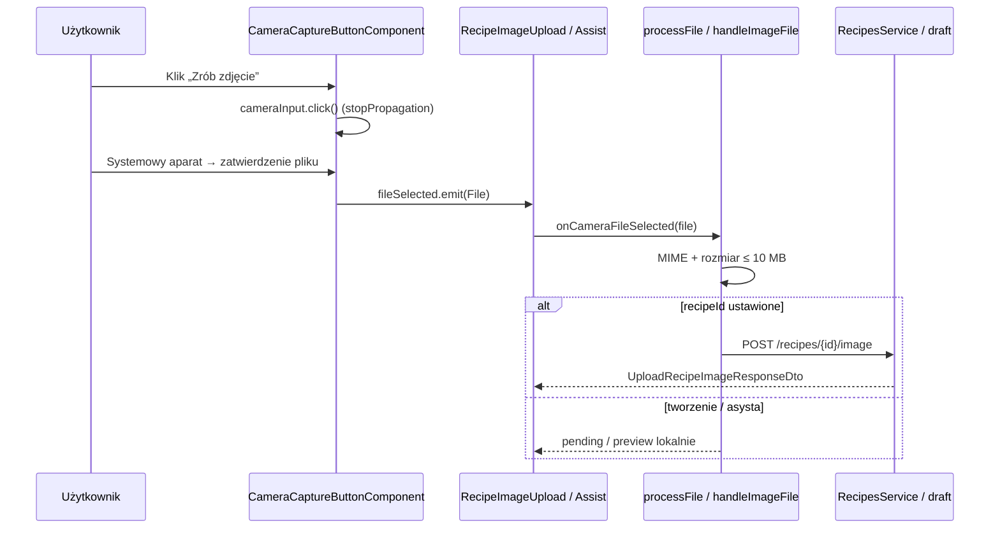

# Plan implementacji widoku — „Zrób zdjęcie” aparatem (PS-93)

## 1. Przegląd

PS-93 dodaje dedykowany przycisk **„Zrób zdjęcie”** uruchamiający systemowy aparat (lub fallback: wybór pliku) przez natywny `<input type="file" capture="environment">`. Plik trafia do **istniejącej** ścieżki obsługi obrazu — ta sama walidacja MIME/rozmiaru, podgląd, Undo (formularz w edycji) i upload / draft AI co przy wyborze pliku, wklejeniu lub schowku (PS-92).

Zmiana **nie wprowadza nowego widoku routowanego**. Dotyczy:

- strefy zdjęcia formularza przepisu (`RecipeImageUploadComponent` na `/recipes/new` i `/recipes/:id/edit`),
- trybu obrazu asysty AI (`RecipeNewAssistPageComponent` na `/recipes/new/assist`).

Wspólny element UI: `CameraCaptureButtonComponent` w `shared` (ukryty input z `capture` + `mat-stroked-button`).

**Endpointy API:** bez zmian.

## 2. Routing widoku

Brak nowych tras, guardów i resolverów.


| Trasa                 | Komponent                                                | Rola PS-93                                                                          |
| --------------------- | -------------------------------------------------------- | ----------------------------------------------------------------------------------- |
| `/recipes/new`        | `RecipeFormPageComponent` → `RecipeImageUploadComponent` | Przycisk aparatu w drop zone i przy podglądzie (`recipeId = null`, plik pending)    |
| `/recipes/:id/edit`   | j.w.                                                     | Po zdjęciu z aparatu: `processFile` → auto-upload `POST /recipes/{id}/image` + Undo |
| `/recipes/new/assist` | `RecipeNewAssistPageComponent`                           | Przycisk gdy `source() === 'image'`; draft po „Dalej” jak dotychczas                |


Trasy pozostają w lazy-loaded `recipesRoutes`, chronione `usernameCompleteMatchGuard`. Asysta: istniejący guard roli (`premium`/`admin` w UI) — PS-93 go nie zmienia.

## 3. Struktura komponentów

```text
src/app/shared/components/camera-capture-button/
└── CameraCaptureButtonComponent                    [NOWY]
    ├── ukryty <input type="file" capture="environment">
    └── output fileSelected: File

/recipes/new | /recipes/:id/edit
└── RecipeFormPageComponent                         [bez zmian szablonu]
    └── RecipeImageUploadComponent                  [MODYFIKACJA]
        ├── #fileInput (bez capture)                [istniejący — galeria / „Zmień zdjęcie”]
        ├── pych-camera-capture-button              [NOWY — osobny input z capture]
        ├── processFile(file)                       [istniejący — walidacja + podgląd + upload/pending]
        └── RecipesService.uploadRecipeImage        [istniejący — tylko edycja]

/recipes/new/assist
└── RecipeNewAssistPageComponent                    [MODYFIKACJA — tryb obrazu]
    ├── handleImageFile(file)                       [istniejący]
    ├── pych-camera-capture-button                  [NOWY]
    └── AiRecipeDraftService → POST /ai/recipes/draft [bez zmian]
```

Diagram przepływu (happy path — aparat):




## 4. Szczegóły komponentów


### `CameraCaptureButtonComponent`

- **Pliki:** `src/app/shared/components/camera-capture-button/camera-capture-button.component.ts|html|scss|spec.ts`
- **Opis:** Reużywalny przycisk uruchamiający ukryty input pliku z atrybutem `capture="environment"` (preferowany tylny aparat na mobile). **Nie** waliduje pliku — emituje surowy `File` do rodzica (DRY: jedna walidacja w `processFile` / `handleImageFile`).
- **Główne elementy HTML:**
  - `<input type="file" class="file-input visually-hidden">` z `accept="image/jpeg,image/png,image/webp"`, `capture="environment"`, `[disabled]="disabled()"`, `(change)="onInputChange($event)"`, `#cameraInput`.
  - `<button mat-stroked-button type="button">` z ikoną `photo_camera`, widocznym tekstem „Zrób zdjęcie”, `aria-label="Zrób zdjęcie aparatem urządzenia"`.
- **Obsługiwane interakcje:**
  - Klik przycisku → `cameraInput.click()` + `$event.stopPropagation()` (nie propaguje do drop zone / paste area).
  - `change` na input: odczyt `files[0]`; `input.value = ''` po obsłudze (ponowne zdjęcie tego samego pliku); brak pliku → **brak emit** (anulowanie aparatu).
  - Klawiatura: domyślne zachowanie focusable `mat-stroked-button`.
- **Walidacja:** brak w komponencie (świadomy wybór — rodzic używa `CLIPBOARD_IMAGE_UI_MESSAGES` i limitów jak przy pliku).
- **Typy:** brak nowych DTO; sygnały wejścia/wyjścia Angular 21 (`input()`, `output()`).
- **Propsy (interfejs komponentu):**


| Propsy         | Typ                      | Domyślnie | Opis                                                              |
| -------------- | ------------------------ | --------- | ----------------------------------------------------------------- |
| `disabled`     | `InputSignal<boolean>`   | `false`   | Wyłącza button i input (upload, `isLoading`, disabled formularza) |
| `buttonClass`  | `InputSignal<string>`    | `''`      | Opcjonalna klasa CSS na przycisku (np. pełna szerokość na mobile) |
| `fileSelected` | `OutputEmitterRef<File>` | —         | Emit po wyborze pliku (nie przy anulowaniu)                       |


- **Importy:** `MatButtonModule`, `MatIconModule`; `ChangeDetectionStrategy.OnPush`; selector `pych-camera-capture-button`.


### `RecipeImageUploadComponent`

- **Pliki:** `src/app/pages/recipes/recipe-form/components/recipe-image-upload/`*
- **Opis:** Strefa zdjęcia US-027 + PS-92 (schowek). PS-93 dodaje `pych-camera-capture-button` obok „Wklej ze schowka” w obu stanach UI.
- **Główne elementy HTML (zmiany):**
  - **Stan pusty (drop zone):** kontener `.upload-actions` (`display: flex; flex-wrap: wrap; gap: 8px; justify-content: center; margin-top: 8px`) obejmujący istniejący przycisk schowka oraz `<pych-camera-capture-button [disabled]="disabled \|\| isUploading" (fileSelected)="onCameraFileSelected($event)" />`.
  - **Stan z podglądem:** w `.image-actions` kolejność: **[ Zmień zdjęcie ] [ Wklej ze schowka ] [ Zrób zdjęcie ]**; `#fileInput` pozostaje **bez** `capture`.
- **Obsługiwane interakcje (nowe):**
  - `onCameraFileSelected(file: File)`: guard `if (disabled \|\| isUploading) return`; `error.set(null)`; `processFile(file)`.
  - Pozostałe: paste, D&D, klik drop zone → `#fileInput`, schowek, usuń, Undo — bez regresji.
- **Warunki disabled przycisku aparatu:** `disabled || isUploading` (przycisk aparatu **zawsze dostępny** gdy API schowka niedostępne — różnica względem PS-92).
- **Walidacja w** `processFile`**:**
  - `file.type` ∈ `['image/jpeg', 'image/png', 'image/webp']` → inaczej `CLIPBOARD_IMAGE_UI_MESSAGES.unsupportedFormat`;
  - `file.size` ≤ `CLIPBOARD_IMAGE_MAX_BYTES` (10 MB) → `fileTooLarge`;
  - sukces: podgląd `FileReader`, tryb create → `pendingFileChanged`, tryb edit → `uploadRecipeImage`.
- **Typy:** `RecipeImageUploadUiState`, `RecipeImageEvent`, `RecipeImageUndoSnapshot`, `UploadRecipeImageResponseDto`.
- **Propsy:** bez zmian — `@Input() recipeId`, `currentImageUrl`, `@Input() disabled`, `@Output() imageEvent`.


### `RecipeFormPageComponent`

- **Opis:** Kontener formularza; **brak zmian** w TypeScript poza ewentualnym importem zależności (jeśli testy integracyjne strony). Logika aparatu w całości w `RecipeImageUploadComponent`.
- **Obsługiwane zdarzenia:** `onImageEvent` — bez zmian.
- **Typy:** `CreateRecipeCommand` / `UpdateRecipeCommand` — bez nowych pól.


### `RecipeNewAssistPageComponent`

- **Pliki:** `src/app/pages/recipes/recipe-new-assist/`*
- **Opis:** Asysta AI; PS-93 rozszerza **tylko** gałąź `source() === 'image'`.
- **Główne elementy HTML (zmiany):**
  - **Pusty stan** (`.paste-content`): pod przyciskiem schowka — ten sam `.upload-actions` + `pych-camera-capture-button`.
  - **Podgląd** (`.image-preview-actions`): „Zrób zdjęcie” obok „Wklej ze schowka” (spójna kolejność z formularzem).
- **Obsługiwane interakcje (nowe):**
  - `onCameraFileSelected(file)`: `if (isLoading()) return`; `handleImageFile(file)`.
- **Walidacja w** `handleImageFile`**:**
  - MIME ∈ `ALLOWED_IMAGE_TYPES` (`AiRecipeDraftImageMimeType`);
  - rozmiar ≤ `CLIPBOARD_IMAGE_MAX_BYTES`;
  - komunikaty: `CLIPBOARD_IMAGE_UI_MESSAGES` w `.error-container`.
- **Typy:** sygnały `source`, `imageFile`, `imagePreviewUrl`, `errorMessage`, `isLoading`; request draftu: `AiRecipeDraftRequestDto` (wariant `source: 'image'`).
- **Propsy:** brak (komponent routowany).


## 5. Typy


### Istniejące DTO (kontrakt API — bez zmian)


| Typ                            | Zastosowanie                                                          |
| ------------------------------ | --------------------------------------------------------------------- |
| `UploadRecipeImageResponseDto` | Odpowiedź `POST /recipes/{id}/image` po zdjęciu z aparatu w edycji    |
| `AiRecipeDraftImageMimeType`   | `'image/png' | 'image/jpeg' | 'image/webp'` — walidacja przed draftem |
| `AiRecipeDraftImageDto`        | `{ mime_type, data_base64 }` — budowane przy „Dalej” z `imageFile()`  |
| `AiRecipeDraftRequestDto`      | Wariant `source: 'image'` + `image`                                   |
| `AiRecipeDraftResponseDto`     | Sukces draftu — bez zmian flow po aparacie                            |


### Stałe współdzielone (już w projekcie — użyć w walidacji rodzica)


| Symbol                                          | Wartość / rola             |
| ----------------------------------------------- | -------------------------- |
| `CLIPBOARD_IMAGE_MAX_BYTES`                     | `10 * 1024 * 1024`         |
| `CLIPBOARD_IMAGE_UI_MESSAGES.unsupportedFormat` | Komunikat inline — format  |
| `CLIPBOARD_IMAGE_UI_MESSAGES.fileTooLarge`      | Komunikat inline — rozmiar |


### Nowe typy ViewModel

**Brak** nowych modeli widoku na poziomie strony ani nowych DTO w `shared/contracts/types.ts`. PS-93 operuje wyłącznie na natywnym `File`.

Opcjonalnie (tylko jeśli zespół chce udokumentować atrybut HTML w TS):

```typescript
/** Wartość atrybutu capture na input file — tylny aparat na urządzeniach mobilnych */
export type CameraCaptureAttribute = 'environment' | 'user';
```

Komponent aparatu może trzymać `capture` jako stałą w szablonie bez eksportu typu.

### Istniejące typy komponentu uploadu (bez zmian struktury)

- `RecipeImageUploadUiState`: `'idle' | 'dragover' | 'uploading' | 'success' | 'error'`
- `RecipeImageEvent`: union zdarzeń do formularza


## 6. Zarządzanie stanem

PS-93 **nie wymaga** NgRx, globalnego store ani dedykowanego hooka/composable.


| Stan                                | Lokalizacja                             | Cel                                  |
| ----------------------------------- | --------------------------------------- | ------------------------------------ |
| `error` / `errorMessage`            | Upload / Asysta                         | Błędy walidacji po aparacie (inline) |
| `previewUrl`, `fileName`, `uiState` | `RecipeImageUploadComponent`            | Podgląd, upload, spinner             |
| `imageFile`, `imagePreviewUrl`      | `RecipeNewAssistPageComponent`          | Wejście do `POST /ai/recipes/draft`  |
| Undo snapshot                       | `RecipeImageUploadComponent` (prywatne) | Po uploadzie w edycji — bez zmian    |


Wzorzec: **Angular signals** + `ChangeDetectionStrategy.OnPush`, `inject()` w komponentach nadrzędnych. `CameraCaptureButtonComponent` jest **bezstanowy** poza referencją do `#cameraInput`.

Custom hook **nie jest wymagany**.

## 7. Integracja API

**Brak nowych endpointów.** Aparat dostarcza ten sam obiekt `File` co wybór z dysku.


| Scenariusz                    | Wywołanie                                                     | Request                                                                            | Response                                                                |
| ----------------------------- | ------------------------------------------------------------- | ---------------------------------------------------------------------------------- | ----------------------------------------------------------------------- |
| Edycja — zdjęcie z aparatu    | `RecipesService.uploadRecipeImage(recipeId, file)`            | `multipart/form-data`; PNG/JPG/WebP; max 10 MB                                     | `UploadRecipeImageResponseDto`                                          |
| Tworzenie — zdjęcie z aparatu | Brak natychmiastowego uploadu                                 | `RecipeImageEvent` `{ type: 'pendingFileChanged', file }`                          | Upload po utworzeniu przepisu (istniejący flow)                         |
| Asysta — zdjęcie z aparatu    | Po „Dalej”: `AiRecipeDraftService` → `POST /ai/recipes/draft` | `AiRecipeDraftRequestDto` z `source: 'image'`, `image: { mime_type, data_base64 }` | `AiRecipeDraftResponseDto` lub błędy `402` / `422` (istniejąca obsługa) |


Walidacja serwera pozostaje ostateczna; UI odrzuca te same przypadki przed requestem.

## 8. Interakcje użytkownika


| Interakcja                                        | Oczekiwany wynik                                                                                 |
| ------------------------------------------------- | ------------------------------------------------------------------------------------------------ |
| Klik „Zrób zdjęcie” (mobile, aparat dostępny)     | Systemowy UI aparatu → po akceptacji podgląd; edycja: upload + snackbar Undo; tworzenie: pending |
| Anulowanie aparatu / pusty `files`                | Brak emit; stan ekranu bez zmian; **brak** komunikatu błędu                                      |
| Zdjęcie z aparatu — zły MIME lub > 10 MB          | Ten sam komunikat inline co przy pliku/schowku; brak aktualizacji podglądu                       |
| Klik „Zrób zdjęcie” gdy jest już podgląd          | Zastąpienie obrazu; Undo w edycji jeśli upload się powiedzie                                     |
| Kolejność: paste, D&D, plik, schowek, aparat      | Metody niezależne; ostatni zaakceptowany plik wygrywa                                            |
| Klik w drop zone (formularz)                      | Nadal otwiera **picker bez capture** — dzięki `stopPropagation` na przycisku aparatu             |
| Desktop / brak aparatu                            | Fallback do standardowego wyboru pliku (AC 7); przycisk nadal widoczny i aktywny                 |
| `isUploading` / `disabled` / asysta `isLoading()` | Przycisk aparatu disabled                                                                        |
| Asysta — tryb „Tekst”                             | Brak `pych-camera-capture-button` w DOM                                                          |
| Asysta — zdjęcie + „Dalej”                        | Draft generowany identycznie jak dla obrazu z pliku/wklejenia                                    |


## 9. Warunki i walidacja


| Warunek                 | Gdzie weryfikowany                           | Wpływ na UI                                                |
| ----------------------- | -------------------------------------------- | ---------------------------------------------------------- |
| MIME ∈ PNG, JPEG, WebP  | `processFile` / `handleImageFile`            | `.upload-error` / `.error-container`; brak podglądu        |
| Rozmiar ≤ 10 MB         | j.w.                                         | Komunikat `fileTooLarge`                                   |
| Anulowanie wyboru pliku | `CameraCaptureButtonComponent.onInputChange` | Brak emit — UI bez zmian                                   |
| Upload w toku           | `RecipeImageUploadComponent`                 | `isUploading` → disabled aparat + drop zone                |
| Formularz zablokowany   | `@Input() disabled`                          | Disabled aparat i pozostałe akcje                          |
| Asysta ładuje draft     | `isLoading()`                                | Disabled aparat, schowek, toggle źródła                    |
| `recipeId` ustawione    | `processFile`                                | Po walidacji natychmiastowy upload (nie blokuje walidacji) |


Warunki API (multipart, typ, rozmiar) są **te same** co dla dotychczasowego uploadu; frontend nie dodaje nowych pól requestu.

## 10. Obsługa błędów


| Scenariusz                                     | Obsługa                                                                                                                            |
| ---------------------------------------------- | ---------------------------------------------------------------------------------------------------------------------------------- |
| Anulowanie aparatu                             | Ciche — brak snackbara i brak inline error                                                                                         |
| Nieobsługiwany format / za duży plik           | Inline (`CLIPBOARD_IMAGE_UI_MESSAGES`); spójnie z PS-92 i wyborem pliku                                                            |
| Błąd sieci przy uploadzie (edycja)             | Istniejący handler w `uploadImage`: `error.set(...)`, `uiState 'error'`, rollback podglądu                                         |
| Błąd draftu AI (`402`, `422`, inne)            | Istniejąca logika asysty — **poza** scope PS-93                                                                                    |
| Niespodziewany błąd odczytu pliku (FileReader) | Rzadki; można ustawić ogólny komunikat w `processFile` jeśli już istnieje wzorzec — nie duplikować nowej ścieżki tylko dla aparatu |
| Urządzenie bez aparatu                         | Brak błędu — file picker; użytkownik wybiera plik ręcznie                                                                          |


Snackbar **tylko** dla Undo po udanym uploadzie w edycji (bez zmian). Błędy walidacji aparatu **nigdy** przez snackbar.

## 11. Kroki implementacji

1. **Utworzyć** `CameraCaptureButtonComponent` w `src/app/shared/components/camera-capture-button/` (standalone, OnPush, selector `pych-camera-capture-button`, szablon zgodny z planem UI PS-93).
2. **Dodać** style `.visually-hidden` dla inputu (reuse klasy z uploadu lub wspólny mixin w SCSS komponentu).
3. **Napisać** testy Vitest komponentu aparatu: emit po `change` z plikiem; brak emit przy pustym `files`; `disabled=true` blokuje input i button.
4. **Zmodyfikować** `recipe-image-upload.component.html`: kontener `.upload-actions` w drop zone; `pych-camera-capture-button` w `.image-actions`; import komponentu w tablicy `imports`.
5. **Dodać** `onCameraFileSelected` w `recipe-image-upload.component.ts` delegujący do `processFile`.
6. **Rozszerzyć** SCSS uploadu: flex wrap, opcjonalnie `@media (max-width: 600px)` — pełna szerokość stroked buttons.
7. **Zmodyfikować** `recipe-new-assist-page.component.html`: przycisk aparatu w `.paste-content` i `.image-preview-actions` (tylko `@if (source() === 'image')`).
8. **Dodać** `onCameraFileSelected` w `recipe-new-assist-page.component.ts` → `handleImageFile`.
9. **Rozszerzyć** testy `recipe-image-upload.component.spec.ts`: spy na `processFile` po `(fileSelected)`; disabled przy `isUploading`.
10. **Rozszerzyć** testy `recipe-new-assist-page.component.spec.ts`: `handleImageFile` po evencie aparatu; disabled gdy `isLoading()`.
11. **Testy regresji:** schowek (PS-92), paste, D&D, file picker — uruchomić istniejące specy + ręczny smoke.
12. **Test manualny (DoD):** Android Chrome i/lub iOS Safari (aparat + anulowanie + zły rozmiar); desktop (fallback picker).
13. **Code review** — potwierdzenie braku zmian w `shared/contracts/types.ts` i braku nowych wywołań API.

